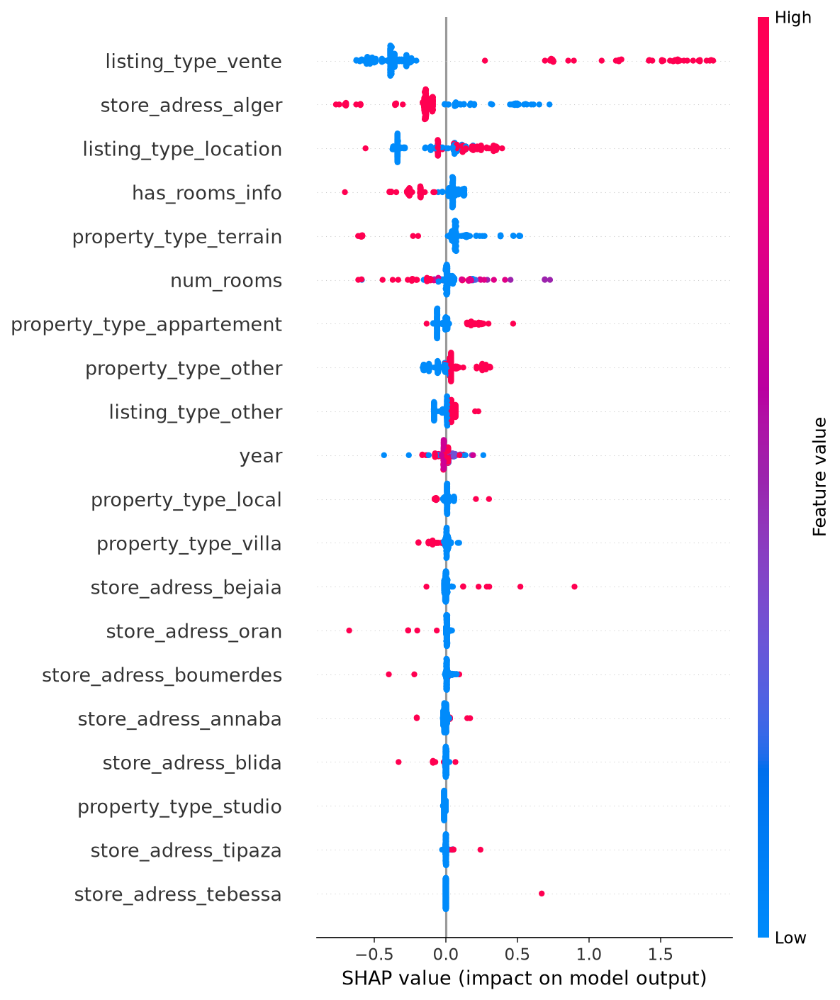

# 🏠 Algerian Real Estate Price Predictor

A machine learning system that predicts real estate prices in Algeria, built end-to-end from raw data collection to a deployed, explainable web app.

## Live Demo
[Try the app here](#)

## Overview

This project predicts property prices across Algeria using listings data, and explains *why* the model makes each prediction using SHAP. It covers the full ML lifecycle: data collection, cleaning, feature engineering, model comparison, explainability, and deployment.

## Key Results

| Model | MAE (DA) | R² |
|---|---|---|
| Linear Regression | 1,065,916 | 0.508 |
| Random Forest | 802,865 | 0.614 |
| Gradient Boosting | 905,697 | 0.607 |
| **XGBoost (best)** | **809,961** | **0.624** |

Trained on 15,532 cleaned listings after removing outliers and non-Algerian entries from a raw dataset of 64,099 records.

## SHAP Feature Importance



Listing type (sale vs. rental) and location in Algiers emerged as the dominant price drivers — consistent with market intuition, while also revealing that the absence of structural features (surface area, floor number) limits the model's explanatory power within a given city.

## Tech Stack

- **Data**: pandas, Selenium (initial scraping attempt), Kaggle dataset
- **ML**: scikit-learn, XGBoost
- **Explainability**: SHAP
- **App**: Streamlit
- **Language**: Python

## Project Structure

```
├── data/
│   ├── raw/                  # original data
│   └── processed/            # cleaned, feature-engineered data
├── src/
│   ├── scraper.py            # Selenium-based scraper (Ouedkniss)
│   ├── preprocess.py         # cleaning & feature engineering
│   └── train.py               # model training, comparison & SHAP
├── models/                    # saved model, explainer, feature names
├── reports/                    # SHAP visualizations
├── app.py                     # Streamlit web app
└── requirements.txt
```

## What I Learned

- Built a Selenium-based scraper and diagnosed why it failed against Ouedkniss's dynamic content and anti-bot measures — a real-world lesson in the limits of scraping.
- Applied log-transformation to handle a heavily right-skewed price distribution, improving R² significantly across all models.
- Compared 4 regression models and selected the best based on both MAE and R², not just one metric.
- Used SHAP to move beyond "black box" predictions — both globally (which features matter most) and locally (why this specific prediction).
- Identified that the model's performance ceiling was due to missing structural features in the data, not model choice — a key insight for future iterations.

## Future Improvements

- Add surface area (m²) and floor number as features — likely the highest-value additions
- Split into separate models for rentals vs. sales given their very different price scales
- Re-scrape with an API-based approach or rotating proxies to get fresher data

## Run Locally

```bash
git clone https://github.com/MohamedOuakki/Algerian-Real-Estate-Predictor.git
cd Algerian-real-estate-predictor
pip install -r requirements.txt
streamlit run app.py
```

## Author

**Ouakki Mohamed Shamseddine** — 4th-year AI/Data Science student at ESI Algiers (École nationale Supérieure d'Informatique)

[LinkedIn](https://www.linkedin.com/in/ouakki-mohamed-chames-eddine-50774b2b4/) · [GitHub](https://github.com/MohamedOuakki)